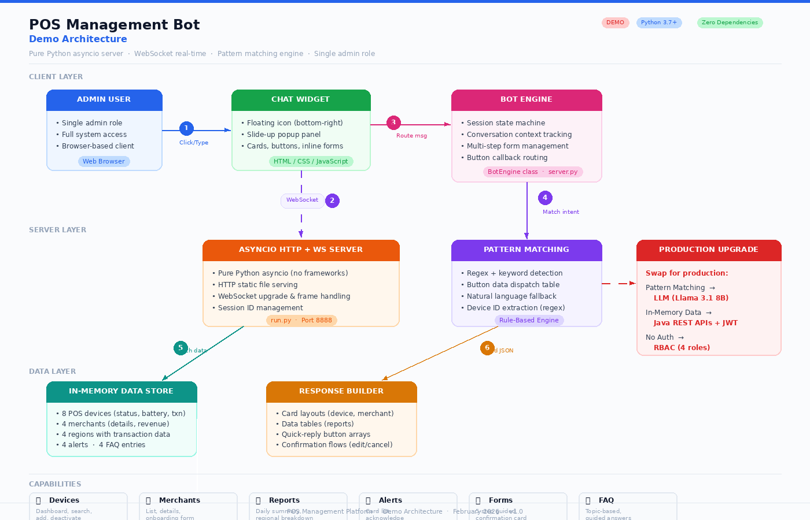

# 🤖 POS Management Bot — AI Chatbot Demo

A fully functional AI-powered chatbot demo for a **POS (Point of Sale) Management Platform**. Features an IRCTC-style button-driven UI with floating chat widget, card layouts, step-by-step forms, and real-time WebSocket communication.



## ✨ Features

- **💬 Floating Chat Widget** — Bottom-right icon with slide-up popup (like Intercom/Tidio)
- **📱 Device Management** — Dashboard, search, add device (5-step form), deactivate with confirmation
- **🏪 Merchant Onboarding** — List, details, add merchant (5-step guided form)
- **📊 Reports & Analytics** — Daily transaction summary, regional breakdown tables
- **🔔 Smart Alerts** — Card-based alert list with acknowledge action
- **❓ FAQ** — Topic-based guided answers
- **🔘 Button-Driven Navigation** — IRCTC-style guided flows, not free-text first
- **📝 Inline Forms** — Step-by-step collection with dropdowns, validation, and confirmation cards
- **⚡ Real-Time** — WebSocket for instant bot responses with typing indicator
- **📱 Mobile Responsive** — Adapts to all screen sizes

## 🏗️ Architecture

| Layer | Component | Technology |
|-------|-----------|------------|
| Client | Chat Widget | HTML / CSS / JavaScript |
| Client | Bot Engine | BotEngine class (Python) |
| Server | HTTP + WebSocket | Pure Python asyncio |
| Data | In-Memory Store | Python dictionaries |

**Zero external dependencies** — runs on Python 3.7+ stdlib only.

### Production Upgrade Path

| Demo (Current) | Production |
|----------------|------------|
| Pattern matching | LLM (Llama 3.1 8B via Ollama) |
| Hardcoded responses | LLM tool calling → REST APIs |
| In-memory dummy data | Java/Spring Boot APIs + Database |
| No authentication | JWT + RBAC (4 roles) |
| Single admin role | Viewer / Manager / Admin / Super Admin |

## 🚀 Quick Start

```bash
git clone https://github.com/dryfryce/pos-bot-demo.git
cd pos-bot-demo
python3 run.py
```

Open **http://localhost:8888** in your browser. Click the 💬 chat icon in the bottom-right corner.

### Requirements

- Python 3.7 or higher (tested up to 3.13)
- No pip install needed — zero dependencies

## 📁 Project Structure

```
pos-bot-demo/
├── run.py              # Asyncio HTTP + WebSocket server
├── server.py           # BotEngine class + dummy data + pattern matching
├── static/
│   ├── index.html      # Chat widget frontend (floating icon + popup)
│   └── architecture.html  # Architecture diagram (HTML version)
├── architecture.png    # Architecture diagram (image)
└── README.md
```

## 📸 Demo

### Landing Page
The platform landing page with feature cards and a hint to try the AI assistant.

### Chat Widget
Click the floating 💬 icon → chat popup slides up with:
- Welcome message with navigation buttons
- Card layouts for devices and merchants
- Step-by-step forms with dropdowns
- Confirmation cards (Confirm / Edit / Cancel)
- Data tables for reports
- Alert cards with acknowledge action

## 🔧 How It Works

1. **User clicks** the floating chat icon → popup opens
2. **WebSocket connects** to the asyncio server
3. **Bot sends** welcome message with navigation buttons
4. **User clicks buttons** → server routes to BotEngine
5. **BotEngine** matches intent via regex/keyword patterns
6. **Response builder** creates cards, tables, forms, or button arrays
7. **JSON response** sent back via WebSocket → rendered in chat

## 📋 Dummy Data

| Entity | Count | Details |
|--------|-------|---------|
| POS Devices | 8 | Status, battery, last txn, merchant |
| Merchants | 4 | Name, region, revenue, device count |
| Regions | 4 | Mumbai, Delhi, Bangalore, Hyderabad |
| Alerts | 4 | Low battery, offline, paper jam, tamper |
| FAQ Topics | 4 | Guided topic-based answers |

## 📄 License

ISC

---

*Built as a demo for the AI-Powered Chatbot for POS Management Platform proposal.*
